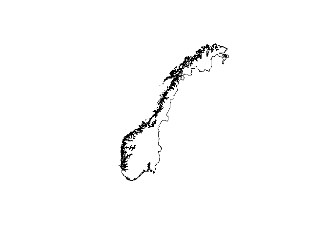

<!-- README.md is generated from README.Rmd. Please edit that file -->

# N2000 Kartdata

Kartdata fra [Kartverket](https://kartverket.no/).

``` r
library(N2000)
plot(sf::st_geometry(Kystkontur))
plot(sf::st_geometry(Riksgrense), add = TRUE)
```


